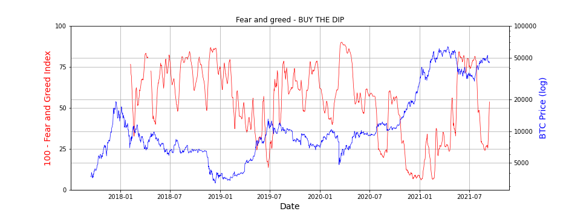

# Dollar Cost Averaging - Custom DCA (buy the dip)


### Overview
Dollar Cost Averaging - DCA: Dividing a sum of money to invest periodically, reducing the impact of volatility on the purchase price. DCA is the commonly accepted risk mitigating way to invest in crypto. But can we do better?

**Buy the dip** - I'm sure you've heard it before but it's much easier said than done. The indicators in this repo are provided to help buy the dip algorithmically: Weighting the buy amount per order to invest more when it's likely crypto is in a dip and less when it is not.

This repo lets you run and backtest DCA strategies for crypto to minimise risk and maximise profits, allowing for user customisation with respect to frequency of purchasing, use of indicators and aggression or weighting

### Setup instructions

1. To get started you will need an exchange account from Binance/FTX/Kraken (Fee reducing referral links below):

    - [x] [binance.com](https://accounts.binance.com/en/register?ref=CP1DAOWU)
    - [x] [ftx.com](https://ftx.com/#a=33799830)
    - [ ] [kraken.com](https://r.kraken.com/KeJqje)


2. Load up your spot wallet with USD or USDT or whatever currency you want to use to buy crypto 
<br></br>
3. Create API keys with 'trading' permissions enabled and load 
<br></br>
4. Put your API keys in a json file called `keys.json` one directory above the repo (Only the exchange keys used to trade need to be included)

```
{
    "binance_keys":{
        "api_key":"XXXXXXXXXXXXXXXXXXXX",
        "secret_key":"XXXXXXXXXXXXXXXXXXXX"
    },
    "ftx_keys":{
        "api_key":"XXXXXXXXXXXXXXXXXXXX",
        "secret_key":"XXXXXXXXXXXXXXXXXXXX"
    },
    "kraken_keys":{
    	"api_key":"XXXXXXXXXXXXXXXXXXXX",
        "secret_key":"XXXXXXXXXXXXXXXXXXXX"
    }
}
```

5. Install the required python packages using `pip install -r requirements.txt` from the root directory
<br></br>
6. Run `python dca.py` to start or `python dca.py -s` to start in simulation mode (places fake trades)
<br></br>
7. Follow the instructions in the command prompt to set up alternatively use the config.json file (Work in progress) 

Places (spot) market buy orders on the exchange at the current price, it then sleeps until the next buy interval. It will save progress so it doesn't have to be continuously run but I would reccomend running this perpetually (on a linux based microcomputer like a Rasberry Pi). Different DCA strategies will be put in as we go!

Strategies tested and planning to be tested:
- [x] According to the Crypto Fear and Greed Index https://alternative.me/crypto/fear-and-greed-index (Buys more when fear is higher, buys less when greed is higher)
- [ ] RSI based DCA
- [ ] Volatility Based DCA


## Fear and Greed


The fear and greed strategy chart shows 100 - fear and greed index (red) and bitcoin price (blue). When fear is high (red line close to 100) invest more and when greed is high (red line close to 0) invest less. By doing this we can invest according to this weighting to increase the amount of BTC held over a long period of time compared to regular DCA.

Current fear and greed:


### Updates
August 27th
FTX Set up and more intuitive UI. Also more backtesting in the analysis notbook

August 12th:
Fear and greed DCA handling for buy amounts lower than the minimum buy amount for each coin

August 8th:
Basic DCA works for all cryptos on Binance, needs to be run permanently


